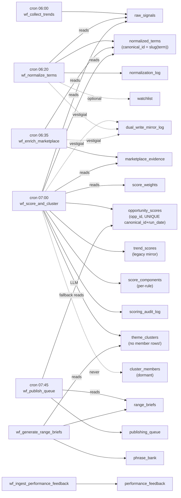

# Layer 2 Feasibility Assessment

> Companion document: [`LAYER2_IMPLEMENTATION_READINESS_CHECKLIST.md`](LAYER2_IMPLEMENTATION_READINESS_CHECKLIST.md)
> Spec under evaluation: [`oportunity-scoring-spec-layer-2.md`](oportunity-scoring-spec-layer-2.md)
> Date: 2026-05-02. Reflects repository state at that time.

## Executive Summary

**Verdict: medium feasibility.** Layer 2 cannot be cleanly implemented on top of Layer 1 as it stands today without first introducing three primitives that the spec requires but the codebase does not yet have: a canonical-signal contract, a transactional outbox, and a versioned scoring-run object that is independent of the daily n8n workflow run. A naive "Layer 2 v0" that simply extends [`opportunity_scores`](db/migrations/0001_init.sql) and [`theme_clusters`](db/migrations/0001_init.sql) is technically possible and would deliver scored output quickly, but it would lock in five concrete Sheets-era assumptions (see "Architectural Gaps") and would have to be torn out the first time a non-Etsy/non-Google source is added.

Five-bullet rationale:

1. **There is no canonical signal record today.** The spec's `signal_id`-keyed entity (§10.1) sits between `raw_signals` (per-observation, no FK to canonical) and [`normalized_terms`](db/migrations/0001_init.sql) (per-term aggregate, identity = `slugify(term)`); neither table fits the contract.
2. **Source coupling is hardcoded into the live scorer.** The inlined Code node in [`n8n/build_score_and_cluster_workflow.mjs`](n8n/build_score_and_cluster_workflow.mjs) explicitly switches on string source names (`google_trends`, `pinterest_trends`, `tiktok_creative`, `etsy_autocomplete`, `amazon_movers`), directly contradicting spec FR-010 and FP-001.
3. **No outbox, no event model, no inter-workflow trigger.** All n8n workflows run on independent cron schedules; the `SPRINT_CLOSEOUT.md` "cascade" is a manual MCP harness, not a runtime event chain. Spec §5.3, §18.2 and FR-008 are unmet.
4. **Idempotency and replay are blocked at the schema level.** `uq_opportunity_scores_canonical_run` on `(canonical_id, run_date)` with `ON CONFLICT DO NOTHING` ([`n8n/build_score_and_cluster_workflow.mjs:46-48`](n8n/build_score_and_cluster_workflow.mjs)) silently no-ops same-day reruns, so the spec's "rescoring should append history rather than mutate old score facts" (§18.3) cannot work without schema changes.
5. **Cluster→opportunity lineage is missing in the live pipeline.** [`cluster_members`](db/migrations/0001_init.sql), [`cluster_history`](db/migrations/0001_init.sql), [`cluster_review_queue`](db/migrations/0001_init.sql) and [`cluster_metrics`](db/migrations/0001_init.sql) all exist in DDL but are never written by any n8n workflow (verified by repo-wide grep). The LLM clustering step at [`n8n/build_score_and_cluster_workflow.mjs:321-357`](n8n/build_score_and_cluster_workflow.mjs) receives a `canonical_ids` array per cluster and discards it after computing `term_count`.

Recommendation: do the three pre-requisite migrations (canonical-signal contract, outbox, versioned `scoring_runs`) and one wiring fix (populate `cluster_members`) before writing any Layer 2 entities.

## Current Layer 1 Architecture

### Runtime entry points

There is no application server. Every runtime entry point is either an n8n cron trigger or a Node CLI script.

| Trigger | Entry point | Cron (Europe/London) | Source of truth |
| --- | --- | --- | --- |
| Schedule | `wf_collect_trends` | `0 0 6 * * *` | [`n8n/wf_collect_trends.json:245-246`](n8n/wf_collect_trends.json) |
| Schedule | `wf_normalize_terms` | `0 20 6 * * *` | [`n8n/wf_normalize_terms.json:213-214`](n8n/wf_normalize_terms.json) |
| Schedule | `wf_enrich_marketplace` | `0 35 6 * * *` | [`n8n/wf_enrich_marketplace.json:212-213`](n8n/wf_enrich_marketplace.json) |
| Schedule | `wf_score_and_cluster` | `0 0 7 * * *` | [`n8n/build_score_and_cluster_workflow.mjs:389`](n8n/build_score_and_cluster_workflow.mjs) |
| Schedule | `wf_publish_queue` | `0 45 7 * * *` | [`n8n/build_publish_queue_workflow.mjs:148`](n8n/build_publish_queue_workflow.mjs) |
| Schedule | `wf_generate_range_briefs_and_phrase_expansion` | various | [`n8n/wf_generate_range_briefs_and_phrase_expansion.json`](n8n/wf_generate_range_briefs_and_phrase_expansion.json) |
| Schedule | `wf_ingest_performance_feedback` | various | [`n8n/wf_ingest_performance_feedback.json`](n8n/wf_ingest_performance_feedback.json) |
| Manual | `npm run n8n:simulate` | n/a | [`n8n/simulate-scheduled-runs.mjs`](n8n/simulate-scheduled-runs.mjs) |
| Manual | `npm run n8n:phase1-gate` | n/a | [`n8n/phase1-gate.mjs`](n8n/phase1-gate.mjs) |
| Manual | `npm run db:migrate` | n/a | [`db/run_migrations.mjs`](db/run_migrations.mjs) |

Workflows are **temporally ordered, not causally linked.** No workflow JSON contains an `n8n-nodes-base.executeWorkflow` node (verified by grep); the SPRINT_CLOSEOUT description of a "cascade through the four downstream workflows via the MCP `executeWorkflow` chain" refers to the manual `simulate-scheduled-runs.mjs` MCP harness used during cutover verification, not a runtime trigger graph.

### Storage

Single Dockerised Postgres 16, container `local-postgres`, db `pod_trends`, owner `pod_admin`, app role `pod_app`, host-mapped on `127.0.0.1:5433`. See [`docker-compose.postgres.yml`](docker-compose.postgres.yml) and [`db/README.md`](db/README.md). Postgres is the only persistence layer; the legacy Google Sheets backend is archived under [`archive/sheets/`](archive/sheets/) and is no longer written.

### The two-tier code organisation

The repository is split, by accident of history, into two parallel implementations:

1. **Live tier — n8n workflows.** Logic that actually runs in production is JavaScript inlined into n8n Code nodes. Four of the seven workflows are regenerated from JS builders ([`n8n/build_score_and_cluster_workflow.mjs`](n8n/build_score_and_cluster_workflow.mjs), [`n8n/build_publish_queue_workflow.mjs`](n8n/build_publish_queue_workflow.mjs), [`n8n/build_ingest_performance_feedback_workflow.mjs`](n8n/build_ingest_performance_feedback_workflow.mjs), [`n8n/build_generate_briefs_bundle.mjs`](n8n/build_generate_briefs_bundle.mjs)); the other three (`wf_collect_trends.json`, `wf_normalize_terms.json`, `wf_enrich_marketplace.json`) are hand-edited directly. There is also a `_apply_pg_handedits.mjs` helper, suggesting hand-edits drift onto generated workflows too.
2. **Vestigial tier — root-level Apps-Script-style modules.** [`scoringEngine.js`](scoringEngine.js), [`opportunityBuilder.js`](opportunityBuilder.js), [`clusterScoringEngine.js`](clusterScoringEngine.js), [`clusterMergeSplit.js`](clusterMergeSplit.js), [`clusterHistoryTracker.js`](clusterHistoryTracker.js), [`clusteringPayloadBuilder.js`](clusteringPayloadBuilder.js), [`weightCalibrator.js`](weightCalibrator.js), [`scoringConfigLoader.js`](scoringConfigLoader.js), [`normalizationAuditor.js`](normalizationAuditor.js), [`observabilityEnvelope.js`](observabilityEnvelope.js), [`sourceContractValidator.js`](sourceContractValidator.js). All use CommonJS `module.exports` / `require` even though [`package.json`](package.json) declares `"type": "module"` — they cannot be `import`-ed by anything in the live tree without throwing. They are reference implementations of the logic that was inlined into n8n nodes; the inlined copies have already drifted (compare `scoreOpportunity` in [`scoringEngine.js`](scoringEngine.js) with the inlined `scoreOpportunity` at [`n8n/build_score_and_cluster_workflow.mjs:239-256`](n8n/build_score_and_cluster_workflow.mjs)).

This matters for Layer 2: any new abstraction that lives in a root-level module is, today, not reachable from the live pipeline. Layer 2 will need either (a) a real Node service that is registered as a runtime entry point, or (b) more inlined Code-node copies that re-encode the same logic and inevitably drift.

### What already resembles Layer 2 building blocks

| Spec concept | Current closest equivalent | Notes |
| --- | --- | --- |
| Scoring run | [`workflow_runs`](db/migrations/0001_init.sql) row + [`scoring_audit_log`](db/migrations/0001_init.sql) row per daily cron | Not versioned by `scoring_version`; one row per workflow execution, not per scoring scope |
| Opportunity candidate | [`opportunity_scores`](db/migrations/0001_init.sql) (25 cols) | No state machine; `tier` and `action` are cosmetic strings |
| Score record | Same row | Spec asks for a separate, append-only `opportunity_score` table |
| Score factors | [`score_components`](db/migrations/0001_init.sql) | Per-rule (e.g. `velocity_high`), not per-factor-family with `factor_reason` |
| Trend cluster | [`theme_clusters`](db/migrations/0001_init.sql) (16 cols) | Cluster→signal lineage missing; LLM-only |
| Cluster members | [`cluster_members`](db/migrations/0001_init.sql) | Schema present, never written |
| Cluster history | [`cluster_history`](db/migrations/0001_init.sql) | Schema present, never written |
| Workflow outbox | none | No table exists |
| Canonical signal | none | `raw_signals` is per-observation, `normalized_terms` is per-term |

### Mermaid: actual data flow

The dotted edges to `cluster_members`, `cluster_history`, `cluster_review_queue`, `cluster_metrics`, and `dual_write_mirror_log` are tables that exist in the schema but are not produced by any current workflow.

## Current Data Model

The schema is defined in a single migration, [`db/migrations/0001_init.sql`](db/migrations/0001_init.sql), with seeds in `0002_seed_sources_config.sql`, `0003_seed_score_weights.sql`, and the role grants in `0004_pod_app_role_grants.sql`. There are 25 tables. No views except the 5 reporting views in [`db/views/`](db/views).

### Layer-1 intake tables

| Table | PK | Important fields | Stable? | Resembles canonical contract? |
| --- | --- | --- | --- | --- |
| [`sources_config`](db/migrations/0001_init.sql) | `source_name` | `enabled`, `market`, `weight`, `pull_frequency` | Yes — seeded with 6 fixed source names | No, but defines the source registry |
| [`raw_signals`](db/migrations/0001_init.sql) | `signal_id` (TEXT, app-generated) | `date_collected timestamptz`, `source TEXT`, `term TEXT`, `related_term`, `category`, `signal_type`, `velocity_hint`, `url`, `raw_payload_json jsonb` | Stable schema, but **no FK to `normalized_terms`** | Closest physical row to a "canonical signal" but missing every spec field except `signal_id`, `source`, `observed_at`/`ingested_at`. |
| [`normalized_terms`](db/migrations/0001_init.sql) | `canonical_id` (TEXT = `norm_<slug(term)>`) | `canonical_term`, `aliases` (pipe-delimited TEXT), `language`, `market`, `primary_category`, `status` ∈ {active, retired, merged, watch}, `last_scored_at`, `latest_opp_id`, `latest_opportunity_score`, `latest_tier` | Stable for current sources; identity is fragile because it depends on `slugify(term)` collisions | Per-term aggregate, **not** per-signal. Missing `contract_version`, `lineage`, `dedupe_key`, `quality_score`, `risk_flags`, `enrichment` |
| [`marketplace_evidence`](db/migrations/0001_init.sql) | `evidence_id` | `canonical_id` FK, `source`, `phrase`, `product_type`, `intent_type`, `evidence_strength`, `captured_at` | Stable; only Etsy and Amazon currently produce rows | Maps loosely to the spec's `competition_metrics` / `enrichment` jsonb but with rigid columns |
| [`normalization_log`](db/migrations/0001_init.sql) | `log_id` | `decision_type` ∈ {created, merged, skipped, low_confidence, retired, duplicate}, `confidence`, `merged_into` | Stable | Useful as an audit input for "additive evidence" model |
| [`source_health`](db/migrations/0001_init.sql) | `health_id` | `source_name`, `status`, `rows_in/valid/rejected`, `consecutive_failures` | Stable | Provides observability data Layer 2 will need but doesn't yet aggregate |

### Layer-2-shaped tables that already exist

| Table | PK | Important fields | Stable? | Resembles spec entity? |
| --- | --- | --- | --- | --- |
| [`opportunity_scores`](db/migrations/0001_init.sql) | `opp_id` (TEXT = `opp_<canonical_id>_<run_date>`) | 9 dimension scores, `raw_weighted_sum`, `risk_penalty`, `opportunity_score`, `tier` ∈ {A,B,C,reject}, `action`, `scorer_version`, `score_notes`. UNIQUE `(canonical_id, run_date)` | Yes for Phase 1 reporting; **not** stable enough for Layer 2 because the conflict key is date-based and so blocks rescoring | Conflates the spec's `opportunity_candidate` (lifecycle) and `opportunity_score` (event) into one row. Missing `candidate_version`, `score_version` (in conflict key), `confidence_score`, `recommendation`, `summary_reason`, `positive_drivers`, `negative_drivers`, `evidence_refs`, `readiness_status` |
| [`score_components`](db/migrations/0001_init.sql) | `component_id` | `opp_id` FK, `dimension`, `component_name`, `raw_value`, `normalized_value`, `weight`, `weighted_contribution`, `notes` | Stable | Per-rule (e.g. `velocity_high`), not per-factor-family. Spec's `opportunity_score_factor` would aggregate these to one row per factor family with `factor_reason` and `evidence` jsonb |
| [`score_weights`](db/migrations/0001_init.sql) | `dimension` | 9 seeded dimensions, `weight`, `enabled`, `last_updated`. See [`db/migrations/0003_seed_score_weights.sql`](db/migrations/0003_seed_score_weights.sql) | Stable | Maps to spec §16.2 factor families with renaming (e.g. `demand_strength` → "Demand strength"), but missing 2 of the spec's 9 families: "Strategic fit" and "Confidence" |
| [`theme_clusters`](db/migrations/0001_init.sql) | `cluster_id` | 16 cols incl. `theme_name`, `theme_slug`, `audience`, `seasonality`, `cluster_score`, `term_count`, `status` ∈ {draft, approved, watchlist, rejected} | Stable schema | Maps to spec's `trend_cluster`, but missing `cluster_key` (deterministic), `cluster_version`, `supporting_signal_ids jsonb`, `aggregate_metrics`, `freshness_window` |
| [`cluster_members`](db/migrations/0001_init.sql) | `member_id` | `cluster_id` FK, `canonical_id` FK, `member_role`, `fit_score`, `evidence_summary`, `reason_included`, `reason_excluded` | **Dormant** — no n8n workflow writes here (verified by grep) | Would be the right home for spec's `supporting_signal_ids`. Currently unusable because the live LLM-clustering step at [`n8n/build_score_and_cluster_workflow.mjs:321-357`](n8n/build_score_and_cluster_workflow.mjs) drops the canonical_ids array after using only its length |
| [`cluster_history`](db/migrations/0001_init.sql) | `history_id` | Audit log of `created/updated/disappeared/merged/split/renamed/status_changed` | Dormant | Would map to the spec's "rescoring should append history" requirement |
| [`cluster_review_queue`](db/migrations/0001_init.sql) | `review_id` | `priority`, `status` ∈ {open, in_progress, resolved, dismissed}, `assigned_to`, `resolution_notes` | Dormant | Could host the spec's `needs_review` lifecycle state |
| [`cluster_metrics`](db/migrations/0001_init.sql) | `metric_id` | Weekly aggregate counters | Dormant | Would feed spec §22 observability metrics |
| [`scoring_audit_log`](db/migrations/0001_init.sql) | `audit_id` | One row per scoring run with `tier_A_count`, `tier_B_count`, `tier_C_count`, `rejected_count`, `avg_opportunity_score`, `top_opportunity`, `scorer_version` | Stable | Closest thing to a `scoring_run` entity, but indexed by `run_date` not by an explicit run id |
| [`trend_scores`](db/migrations/0001_init.sql) | `score_id` | Mirrors `opportunity_scores` with the legacy "decision" enum `{design_now, review_required, watchlist, reject}`. Parity-checked in `phase1-gate.mjs` Gate 6 | Stable but **vestigial post-cutover** — kept for Phase 1 dashboard parity | Direct holdover from the Sheets `trend_scores` tab |

### Workflow / observability infra

| Table | Purpose | Layer 2 relevance |
| --- | --- | --- |
| [`workflow_runs`](db/migrations/0001_init.sql) | One row per workflow execution | Substitutes weakly for `scoring_run`; not enough metadata |
| [`stage_run_logs`](db/migrations/0001_init.sql) | Per-stage start/end events with `event_type` ∈ {start, end, retry, warn, error} | Useful as a backbone for outbox-style observability |
| [`pipeline_locks`](db/migrations/0001_init.sql) | Advisory locks per workflow/resource | Helps with single-writer guarantees during rescoring |
| [`dual_write_mirror_log`](db/migrations/0001_init.sql) | Audit of dual-write to Sheets vs Postgres during cutover. Comment: "vestigial post-cutover" | Pure Sheets-era residue; Layer 2 should remove the writes |

### Downstream tables (Stage 5+)

| Table | Purpose |
| --- | --- |
| [`range_briefs`](db/migrations/0001_init.sql), [`phrase_bank`](db/migrations/0001_init.sql) | Brief generation (Stage 6) |
| [`watchlist`](db/migrations/0001_init.sql) | Manual review |
| [`publishing_queue`](db/migrations/0001_init.sql) | Stage 7 handoff with `idempotency_key` UNIQUE |
| [`performance_feedback`](db/migrations/0001_init.sql) | Post-launch metrics keyed by `opp_id` |

`publishing_queue` is the closest existing structure to a real "outbox": it has an `idempotency_key`, attempt counter, status enum {pending, processing, published, rejected, failed, cancelled}, and is upserted via `ON CONFLICT (idempotency_key) DO UPDATE` ([`n8n/build_publish_queue_workflow.mjs:73-86`](n8n/build_publish_queue_workflow.mjs)). It is **table-of-work**, not **table-of-events** — it cannot serve as the `workflow_outbox` because it stores one row per (cluster, brief, week), not one row per state change.

### Reporting views

[`db/views/v_dashboard_summary.sql`](db/views/v_dashboard_summary.sql), [`db/views/v_dashboard_top10`](db/views/v_dashboard_summary.sql), [`db/views/v_feedback_rollup.sql`](db/views/v_feedback_rollup.sql), [`db/views/v_publish_queue_status.sql`](db/views/v_publish_queue_status.sql), [`db/views/v_source_health_today.sql`](db/views/v_source_health_today.sql), [`db/views/v_stage_run_health_24h.sql`](db/views/v_stage_run_health_24h.sql). All read from the existing tables. None implement the spec §21.3 views (current approved opportunities, review queue, latest scores, score factor breakdown, lineage explorer, scoring run health).

## Canonical Contract Readiness

Per spec §10.1 (canonical signal entity). Status legend: `ready` = field already exists with the spec's intended meaning; `partial` = approximation exists; `missing` = no representation; `unclear` = present but ambiguously defined.

| Spec field | Current implementation source | Readiness | Notes |
| --- | --- | --- | --- |
| `signal_id` | `raw_signals.signal_id` (TEXT, app-generated, e.g. `sig_<source>_<hash>`) | `partial` | The physical column exists but in the wrong table — `raw_signals` is per-observation and Layer 2 needs one canonical signal that may aggregate multiple raw rows. The `normalized_terms.canonical_id` is per-term, also wrong. The spec's signal does not exist as a row anywhere. |
| `contract_version` | none | `missing` | No table or column carries a contract version. The whole concept of a versioned contract is absent. |
| `source_type` | `raw_signals.source` (free TEXT) and `sources_config.source_name` (TEXT PK) | `partial` | Today's `source` is a specific source identifier (`google_trends`), not a family (`search`). The spec wants both `source_type` (family) and `source_name` (specific). Only the latter exists. |
| `source_name` | `raw_signals.source`, `sources_config.source_name` | `ready` | Naming differs but semantics match. |
| `source_record_id` | `raw_signals.signal_id` overloaded | `partial` | The original upstream record ID is not separately preserved; `signal_id` is app-generated, not source-given. `raw_payload_json` may contain it but is not normalised. |
| `intake_run_id` | `workflow_runs.run_id` (loosely) | `partial` | A `run_id` exists per workflow execution but `raw_signals` does not store it on the row, so traceability from a signal back to its producing run requires a cross-table join via `date_collected` — fragile. |
| `observed_at` | `raw_signals.date_collected timestamptz` | `partial` | Today this column blurs "observed in source" and "ingested by us". The spec wants them split. |
| `ingested_at` | none (implicit in `date_collected`) | `missing` | No separate ingestion timestamp. |
| `normalized_topic` | `normalized_terms.canonical_term` | `partial` | Reasonable proxy but only at the per-term level; a `raw_signals` row has no direct topic field. |
| `normalized_niche` | `normalized_terms.primary_category` | `partial` | Computed by majority vote in [`wf_normalize_terms.json` Build node](n8n/wf_normalize_terms.json). Single value, not structured. |
| `normalized_sub_niche` | none | `missing` | No sub-niche column. |
| `audience_hint jsonb` | none directly; `opportunity_scores.target_audience` (TEXT) is derived | `missing` | Current pipeline derives audience by regex-matching `IDENTITY_WORDS` against the term inside the scoring Code node ([`n8n/build_score_and_cluster_workflow.mjs:215`](n8n/build_score_and_cluster_workflow.mjs)). Not stored as structured signal-level data. |
| `product_type_hints jsonb` | `marketplace_evidence.product_type` (TEXT, per-evidence-row) and `opportunity_scores.product_formats` (pipe-delimited TEXT) | `partial` | Stored at evidence and opportunity level, not at signal level, and not as jsonb. |
| `trend_metrics jsonb` | `raw_signals.velocity_hint` (TEXT enum low/medium/high), `raw_signals.raw_payload_json` | `partial` | Velocity exists as a coarse enum; counts/deltas/recency live unstructured inside `raw_payload_json` per source. |
| `sentiment_metrics jsonb` | none | `missing` | No sentiment data anywhere. |
| `competition_metrics jsonb` | `marketplace_evidence.evidence_strength` (per-row), `opportunity_scores.competition_score` | `partial` | Aggregated downstream; signal-level competition jsonb does not exist. |
| `seasonality_hint jsonb` | `opportunity_scores.seasonality_flag` (TEXT enum), `opportunity_scores.season_score` | `partial` | Computed in scoring Code node from term text + occasion-word match; never stored at signal level. |
| `enrichment jsonb` | `raw_signals.raw_payload_json` (per source, free-form) | `partial` | Free-form blob, not normalised or namespaced. |
| `risk_flags jsonb` | none structured; computed at scoring time as `compliance_risk` (TEXT enum) and `risk_flags` (array) by `deriveRisk()` in [`n8n/build_score_and_cluster_workflow.mjs:212`](n8n/build_score_and_cluster_workflow.mjs) from regex matches on `BRAND_CELEB_RISK_WORDS` / `NEWS_EVENT_RISK_WORDS` | `missing` | Not persisted; recomputed every run from term text. |
| `quality_score numeric` | `normalization_log.confidence` (per decision) | `partial` | A confidence number exists but only on the normalisation decision row, not on the signal/canonical record. |
| `lineage jsonb` | none | `missing` | The closest thing is the implicit chain `opportunity_scores.canonical_id → normalized_terms.canonical_id ← slugify(raw_signals.term)`. No FK from `raw_signals` to `normalized_terms`; no jsonb provenance blob. |
| `dedupe_key` | none | `missing` | `normalized_terms.canonical_id` acts as a pseudo-dedupe key (`norm_<slug(term)>`) but is not exposed to consumers as a contract field. `raw_signals` has no dedupe key beyond `signal_id` itself. |
| `status` | `normalized_terms.status` ∈ {active, retired, merged, watch} | `partial` | Per-term status exists; per-signal status (ready, suppressed, invalid, archived) does not. |

**Score: 4 ready or near-ready / 11 partial / 7 missing (out of 22 contract fields).** The shape of the contract is roughly half-present, but every "partial" carries an architectural mismatch (wrong table grain, wrong type, derived-not-stored), so the practical readiness is closer to "missing" for Layer 2 consumption purposes.

## Workflow Compatibility

Each row classifies how the existing pipeline supports a Layer 2 workflow obligation.

| Capability | Status | Reasoning |
| --- | --- | --- |
| Event-driven scoring (spec §18.1, FR-008) | **not currently viable** | No outbox table, no LISTEN/NOTIFY, no readiness flag column on `normalized_terms`. Workflows are cron-triggered only. The `wf_score_and_cluster` reads from `normalized_terms WHERE LOWER(status) = 'active'` ([`n8n/build_score_and_cluster_workflow.mjs:396`](n8n/build_score_and_cluster_workflow.mjs)) plus `raw_signals WHERE date_collected::date = CURRENT_DATE` — this is a polled batch, not an event consumer. |
| Batch scoring (spec §18.1) | **already supported** | The daily 07:00 cron on `wf_score_and_cluster` is exactly batch scoring. Ingest, score, audit, mirror in a single n8n DAG. |
| Replay / rescoring (spec §18.3, FR-007) | **not currently viable** | `uq_opportunity_scores_canonical_run` UNIQUE on `(canonical_id, run_date)` ([`db/migrations/0001_init.sql:382-383`](db/migrations/0001_init.sql)) plus `ON CONFLICT (canonical_id, run_date) DO NOTHING` ([`n8n/build_score_and_cluster_workflow.mjs:46-48`](n8n/build_score_and_cluster_workflow.mjs)) means a same-day rescore writes nothing; a different-day rescore on historical inputs would silently pretend the historical input is "today". A "replay" semantic where `score_version` is part of the key does not exist. |
| Score versioning (spec §5.4, §16.3) | **supported with major refactor** | `opportunity_scores.scorer_version` exists as a column but is hardcoded to `'1.0.0'` (`n8n/build_score_and_cluster_workflow.mjs:240, 288`) and **not in the conflict key**. To support versioning the unique index must change to `(canonical_id, run_date, scorer_version)` and the score writer must stop hardcoding the version. |
| Auditability and lineage (spec §27.1, FR-006) | **supported with major refactor** | Per-run audit exists in `scoring_audit_log` and per-rule explanation exists in `score_components`. But cluster→opportunity lineage is broken (`cluster_members` is empty), opportunity→signal lineage is implicit (text-match), and there is no jsonb `evidence_refs` column on the score row. The pieces are reachable but partly via reconstruction. |
| Outbox / event publication (spec §5.3, FR-008) | **not currently viable** | No `workflow_outbox` table; no `event_id`, `aggregate_type`, `event_type`, `schema_version` columns anywhere. `publishing_queue` is a queue-of-work, not an event log. Adding outbox is a new migration plus a publisher worker — neither exists. |
| Downstream contract for Stage 5 (spec §19.2) | **supported with moderate refactor** | Stage 6 (`wf_generate_range_briefs`) and Stage 7 (`wf_publish_queue`) already read from `theme_clusters`, `range_briefs`, and `opportunity_scores` and write to `publishing_queue`. They could keep working if Layer 2 exposes compatibility views. The `fallback_scores` CTE in [`n8n/wf_publish_queue.json:125`](n8n/wf_publish_queue.json) (Tier C backfill) is a Sheets-era hack that should be removed when Layer 2 routing is live. |
| Idempotency for opportunity creation (spec §18.3) | **supported with moderate refactor** | The `ON CONFLICT DO NOTHING` keeps the daily cron from creating duplicates within a day, but the natural-key construction `opp_<canonical_id>_<run_date>` ([`n8n/build_score_and_cluster_workflow.mjs:240`](n8n/build_score_and_cluster_workflow.mjs)) means rescore = same row = no-op. Spec wants append-only score history, which is incompatible with this approach. |
| Confidence modeling (spec §16.4) | **not currently viable** | No `confidence_score` column on `opportunity_scores`. `normalization_log.confidence` is per-normalisation-decision, not per-score. Need a new column and a derivation routine. |
| Lifecycle state machine (spec §13) | **not currently viable** | No state column matching {new, ready_for_scoring, scoring, scored, needs_review, approved_for_creative, rejected, archived}. Today: `tier` is a score band, `action` is a free-text instruction, `status` only exists on `theme_clusters` ({draft, approved, watchlist, rejected}). The spec's state machine has no home. |

## Architectural Gaps

### Missing canonical abstractions
- No `canonical_signal` row exists between `raw_signals` (per-observation) and `normalized_terms` (per-term). Layer 2's primary contract surface is therefore not buildable from a SELECT.
- No `opportunity_candidate` distinct from `opportunity_score`. They are conflated in `opportunity_scores`.
- No `scoring_run` distinct from `workflow_runs`. The "run" today is whatever the n8n scheduler did, not a domain event.

### Missing schema fields (vs. spec §10.1, §12)
Listed in the canonical-contract table above. Highest impact: `contract_version`, `source_type` (family), `lineage jsonb`, `dedupe_key`, `confidence_score` on score, `score_version` in conflict key, `readiness_status` on candidate, `recommendation` and `summary_reason` on score, `cluster_key` on cluster, `supporting_signal_ids` on cluster.

### Tightly coupled source-specific logic
The live scoring Code node hardcodes specific Layer 1 source names:
- [`n8n/build_score_and_cluster_workflow.mjs:223-224`](n8n/build_score_and_cluster_workflow.mjs): `signalSources.has('google_trends')`, `'pinterest_trends'`, `'tiktok_creative'`.
- [`n8n/build_score_and_cluster_workflow.mjs:223`](n8n/build_score_and_cluster_workflow.mjs): `evidence.some(r => r.source.toLowerCase() === 'amazon_movers')`.
- [`n8n/build_score_and_cluster_workflow.mjs:217`](n8n/build_score_and_cluster_workflow.mjs): `etsyRows = evidence.filter(r => r.source.toLowerCase() === 'etsy_autocomplete')`.

Audience and risk derivation also use term-text regex against fixed wordlists (`IDENTITY_WORDS`, `OCCASION_WORDS`, `BRAND_CELEB_RISK_WORDS`, `NEWS_EVENT_RISK_WORDS` at [`n8n/build_score_and_cluster_workflow.mjs:197-200`](n8n/build_score_and_cluster_workflow.mjs)) instead of consuming structured signals. Adding a new source means editing scoring code, violating spec FR-010 / FP-001 / FP-002.

### Weak lineage
- No FK `raw_signals.canonical_id` → `normalized_terms.canonical_id`. Reconstructed at runtime by `slugify(raw.term) === existing canonical_id`. Any change to the slug rule, normalisation logic, or the term itself silently drops history.
- `cluster_members` is empty in production: cluster→canonical_id is held only inside the LLM JSON response, then discarded.
- `opportunity_scores.opp_id` does not reference any cluster, so opp↔cluster is by `canonical_id` join only, and a canonical_id can in principle appear in multiple clusters.
- `evidence_refs jsonb` (spec §12.3) does not exist; explanations are spread across `score_components.notes` text fields.

### Weak state modeling
- `opportunity_scores` has no lifecycle column; `tier` and `action` are derived strings.
- Cluster-level `status` exists ([`db/migrations/0001_init.sql:166`](db/migrations/0001_init.sql)) and is a step in the right direction, but the live workflow always inserts `'draft'` ([`n8n/build_score_and_cluster_workflow.mjs:353`](n8n/build_score_and_cluster_workflow.mjs)) and never transitions it.
- No "approved_for_creative" or "needs_review" semantics to drive Stage 6 routing. `wf_publish_queue` works around this with the `fallback_scores` CTE.

### Missing run / batch tracking
- `scoring_audit_log` is keyed by `(audit_id, run_date, run_id)` but `run_id` here is the n8n workflow run, not a scoring scope. There is no notion of "score this subset, version Y, replay" with its own ID.
- No `scope` jsonb on the audit row — spec §12.5 wants the run to carry what it processed.

### Missing idempotency controls
- The conflict key `(canonical_id, run_date)` makes same-day reruns silent no-ops and historical reruns either no-ops or destructive overwrites depending on the date. Spec §18.3 wants append-only history.
- The score writer has no `(scoring_run_id, opportunity_id, score_version)` natural key.
- Outbox idempotency does not exist because the outbox does not exist.

### Missing observability for Layer 2
- No view of "current approved opportunities", "review queue", "latest scores", "score factor breakdown", "lineage explorer", or "scoring run health" (spec §21.3). Existing views ([`db/views/`](db/views)) cover Phase 1 dashboards only.
- No dead-letter table (spec §22) or contract-validation failure counter.

### Missing event / outbox support
- No `workflow_outbox` table.
- No publisher worker pattern (no Node service is registered as a runtime entry point).
- Inter-workflow handoff is via shared tables read on cron, which means downstream workflows cannot react to "trend_batch_ready", only to "the wall clock said 07:45".

### Surviving Sheets-era assumptions in code
1. **Term-string identity.** `canonical_id = norm_<slug(term)>` ([`n8n/wf_normalize_terms.json` Build node, line ~425](n8n/wf_normalize_terms.json)) is the original Sheets identity strategy. It bakes the assumption that the term string is the entity, not a property of the entity.
2. **`trend_scores` as the decision surface.** `wf_score_and_cluster` writes both `opportunity_scores` and `trend_scores` and `phase1-gate.mjs` Gate 6 enforces parity between them. `trend_scores.decision` ∈ {`design_now`, `review_required`, `watchlist`, `reject`} is the old Sheets dashboard vocabulary, not a state machine.
3. **`dual_write_mirror_log` writes per stage.** Every workflow appends mirror rows ([`n8n/build_score_and_cluster_workflow.mjs:121-135`](n8n/build_score_and_cluster_workflow.mjs)) even though the Sheets mirror is gone. Pure overhead.
4. **`fallback_scores` CTE.** [`n8n/wf_publish_queue.json:125`](n8n/wf_publish_queue.json) backfills the queue from Tier C opportunities when no briefs exist, "to keep the queue non-empty" — a Sheets-era UX affordance, not a Layer 2 routing decision.
5. **`run_date DATE` keys everywhere.** A daily date is the de facto run identifier (`opportunity_scores.run_date`, `trend_scores.run_date`, `scoring_audit_log.run_date`). Spec wants `scoring_run_id UUID` as the run dimension and `created_at timestamptz` as the temporal one. Daily-date keying is a direct Sheets tab-naming pattern.
6. **Hand-edited workflow JSON.** The presence of [`n8n/_apply_pg_handedits.mjs`](n8n/_apply_pg_handedits.mjs) suggests post-cutover hand-edits are being re-applied to generated workflows. Layer 2 will need a single source of truth or this drift will compound.

## Pre-Implementation Refactors

### Must do before Layer 2
1. **Define and materialise the canonical-signal contract.** Either (a) a new table `canonical_signals` (preferred for write semantics) with the spec §10.1 fields, populated by an extension to `wf_normalize_terms` and backfilled from `raw_signals`+`normalized_terms`+`marketplace_evidence`; or (b) a Postgres view `v_canonical_signals` over the same sources for Phase 1 read-only use. Either way, `contract_version`, `lineage jsonb`, `dedupe_key`, `source_type` (family) must be present.
2. **Add `workflow_outbox` table.** Minimum columns: `event_id UUID PK`, `aggregate_type TEXT`, `aggregate_id TEXT`, `event_type TEXT`, `payload jsonb`, `schema_version TEXT`, `scheduled_at timestamptz`, `processed_at timestamptz`, `retry_count INTEGER`, `status TEXT`. Wire `wf_score_and_cluster` to insert outbox rows in the same transaction as `opportunity_scores`. Build a publisher worker that processes the outbox.
3. **Introduce `scoring_runs` table separate from `workflow_runs`.** Columns per spec §12.5: `scoring_run_id`, `trigger_type` ∈ {event, batch, replay, manual, scheduled}, `trigger_ref`, `scoring_version`, `scope jsonb`, `status`, `metrics jsonb`, `started_at`, `finished_at`. `wf_score_and_cluster` should create one of these per execution and stamp every score with the `scoring_run_id`.
4. **Redesign idempotency for the score writer.** Replace `uq_opportunity_scores_canonical_run` UNIQUE `(canonical_id, run_date)` with `(canonical_id, scoring_run_id)` or `(canonical_id, scoring_version, scope_hash)` so reruns append history rather than no-op. Remove `ON CONFLICT DO NOTHING` from the score writer in [`n8n/build_score_and_cluster_workflow.mjs:46-48`](n8n/build_score_and_cluster_workflow.mjs).
5. **Wire `cluster_members` and stop discarding the LLM's `canonical_ids`.** [`n8n/build_score_and_cluster_workflow.mjs:321-357`](n8n/build_score_and_cluster_workflow.mjs) currently uses `canonical_ids.length` as `term_count` and drops the array. It should insert one `cluster_members` row per id in the same transaction as the `theme_clusters` row.
6. **Add a real lineage column.** Add `raw_signals.canonical_id TEXT REFERENCES normalized_terms (canonical_id)` and have `wf_normalize_terms` populate it. Without this, all "lineage" claims are reconstructions.

### Should do before Layer 2
1. **Promote `source_type` (family) to first-class.** Add `sources_config.source_type` ∈ {marketplace, search, social, reviews, csv, internal} and have all consumers use that family instead of the specific source name. Eliminates the hardcoded source switches in the scoring Code node.
2. **Replace term-text heuristics with structured fields on `canonical_signals`.** `audience_hint`, `risk_flags`, `seasonality_hint` should be normalised at intake time, not regex-derived inside the scorer.
3. **Add a real lifecycle state column.** New `opportunity_candidate.readiness_status` matching spec §13.1 states.
4. **Add `confidence_score` to the score row** and a derivation routine (spec §16.4).
5. **Sunset `dual_write_mirror_log` writes** in every n8n builder. The Sheets writer is gone; the audit is no longer informative.
6. **Add observability views per spec §21.3** before turning Layer 2 on, so on-call has signal from day one.
7. **Decide whether the root-level vestigial JS modules should be deleted, ported to ESM, or wrapped in a real Node service.** Today they confuse the boundary between "spec" and "code".

### Can defer until after first Layer 2 release
1. Replace the LLM clustering with a deterministic clusterer (the vestigial [`clusterScoringEngine.js`](clusterScoringEngine.js) and [`clusterMergeSplit.js`](clusterMergeSplit.js) sketch this).
2. Productionise [`weightCalibrator.js`](weightCalibrator.js) for feedback-driven weight retraining.
3. Build the spec §19.3 HTTP API. Phase 1 can ship with table reads and outbox events only.
4. Build a UI for the review queue.
5. Multi-source backfill (CSV, social listening) — once the contract holds, adding a source is a Layer 1 concern.

## Recommended Implementation Path

The five candidates from the brief, evaluated against the actual repo state:

| Option | Pros | Cons | Verdict |
| --- | --- | --- | --- |
| **A. Implement Layer 2 directly on current tables** | Fastest. Schema unchanged; all dashboards keep working. Score writer is mostly already there. | Locks in 5 Sheets-era assumptions. Source coupling stays hardcoded. Replay still impossible. The first new source will force a redo. | Reject |
| **B. Add a canonical contract layer/view first** | Insulates Layer 2 from `raw_signals`/`normalized_terms` shape. Enables the spec's "additive evidence" model. Cheapest of the contract-discipline options because a view is non-destructive. | A view alone cannot carry `contract_version` or new fields without backfilling source data. Some fields (`lineage`, `dedupe_key`, `source_type`) need to be persisted, not derived. | Necessary but not sufficient |
| **C. Add an outbox/event model first** | Unblocks event-driven scoring, replay-by-event, and downstream Stage 5 contracts. | Without a canonical contract upstream, the events would carry today's inconsistent payloads. Solves orchestration before solving data. | Necessary, sequence after B |
| **D. Add a scoring service/worker first** | Removes the n8n Code-node duplication and the vestigial-JS confusion. Makes versioning, replay, and confidence modeling natural. | Largest architectural change. Risks duplicating logic during transition. Without B/C the worker reads the same brittle inputs. | Defer until after B/C |
| **E. Introduce intermediate normalization hardening first** | Cheap. Strengthens the lineage chain that everything else depends on. Adds the `raw_signals.canonical_id` FK and structured `risk_flags` / `audience_hint` at intake. | Doesn't on its own deliver any Layer 2 capability; only removes blockers. | Necessary, sequence with B |

### Recommendation

**Sequence: E → B → C → migrate score writer → D (deferred).**

1. **E first (1–2 days).** Add `raw_signals.canonical_id` FK and a backfill, populated by `wf_normalize_terms`. Promote `sources_config.source_type` (family). Stop the `dual_write_mirror_log` writes.
2. **B second (3–5 days).** Add `canonical_signals` (table, not view, so it can carry `contract_version`, `lineage`, `dedupe_key`). Populate from the Layer 1 stages on each cron pass. Add a Postgres `CHECK` enforcing the required fields.
3. **C third (2–3 days).** Add `workflow_outbox` and a minimal Node publisher entry point in `package.json` scripts. Wire `wf_score_and_cluster` to write outbox events `opportunity_scored`, `opportunity_needs_review` in the same transaction as the score row.
4. **Migrate the score writer (3–5 days).** Add `scoring_runs`, change the `opportunity_scores` conflict key, hardcoded `scorer_version='1.0.0'` becomes a config value, replace per-rule `score_components` with per-factor `opportunity_score_factor`. Keep `opportunity_scores` and `trend_scores` as compatibility views so [`db/views/v_dashboard_summary.sql`](db/views/v_dashboard_summary.sql) and `phase1-gate.mjs` Gate 6 keep passing.
5. **D deferred.** A real Node scoring worker can replace the inlined Code-node implementation once 1–4 are stable.

This sequence is preferred because each step is independently shippable, each step removes a concrete blocker without depending on the next, and the cumulative path lands on a Layer 2 surface that satisfies spec FR-001, FR-006, FR-007, FR-008, FR-010, and FP-001/FP-002/FP-005 — the future-proofing requirements that the spec calls out as the architectural reason for Layer 2 to exist.

## Feasibility Verdict

**Rating: medium feasibility.**

- **Layer 2 is not feasible "now" without first restructuring Layer 1**, if "Layer 2" means the spec's contract-disciplined, replay-able, outbox-backed, source-agnostic decisioning layer. The contract surface (canonical signal), the orchestration surface (outbox), and the run-identity surface (`scoring_runs`) are missing, and the score writer's idempotency strategy actively blocks replay.
- **Layer 2 is feasible "now"** if it means a v0 that adds an explicit lifecycle state column, a confidence column, and a versioned scoring run on top of the existing `opportunity_scores` and `theme_clusters` tables. This delivers FR-002 through FR-005 and partially FR-006, but not FR-007, FR-008, or FR-010, and it would inherit five Sheets-era assumptions.

**Constraints under which the "feasible now" path is acceptable:**
- A second non-Etsy/non-Google Layer 1 source is not added during the v0 window.
- Scoring is read-only batch only; no replay, no rescoring, no event consumers.
- Downstream Stage 5/6 keeps reading from `theme_clusters` and `range_briefs` directly (no event subscription).
- The `dual_write_mirror_log` and `trend_scores` parity check stays in place to keep `phase1-gate.mjs` Gate 6 green.

**Minimum readiness work before a contract-disciplined Layer 2:** items 1–6 in "Must do before Layer 2" above. Estimated 9–15 working days, sequenced as recommended.

## Likely Files and Modules to Change

### Database
- [`db/migrations/0001_init.sql`](db/migrations/0001_init.sql) — read-only reference; do not edit applied migration.
- New migration `db/migrations/0005_canonical_signals.sql` — `canonical_signals` table + indexes + grants.
- New migration `db/migrations/0006_workflow_outbox.sql` — `workflow_outbox` table + indexes + grants.
- New migration `db/migrations/0007_scoring_runs.sql` — `scoring_runs` table + relax `opportunity_scores` conflict key.
- New migration `db/migrations/0008_lineage_fk.sql` — `raw_signals.canonical_id` FK + backfill, `sources_config.source_type` column.
- New migration `db/migrations/0009_opportunity_lifecycle.sql` — `readiness_status`, `confidence_score`, `score_version` in conflict key.
- New migration `db/migrations/0010_compat_views.sql` — replace `opportunity_scores` and `trend_scores` with views over the new tables, or keep them as legacy and add new tables alongside.
- [`db/views/`](db/views) — add Layer 2 views: `v_approved_opportunities.sql`, `v_review_queue.sql`, `v_latest_scores.sql`, `v_score_factor_breakdown.sql`, `v_lineage_explorer.sql`, `v_scoring_run_health.sql`, `v_workflow_outbox_health.sql`.
- [`db/check-schema-columns.mjs`](db/check-schema-columns.mjs) — extend with new tables.
- [`db/run_migrations.mjs`](db/run_migrations.mjs) — no change expected; supports the new migrations as-is.
- [`db/backfill_sheets_to_pg.mjs`](db/backfill_sheets_to_pg.mjs) — no change; vestigial post-cutover.

### n8n workflows and builders
- [`n8n/build_score_and_cluster_workflow.mjs`](n8n/build_score_and_cluster_workflow.mjs) — biggest change surface. Replace inlined `scoreOpportunity` / `buildCandidateOpportunity` with a call into the canonical-signal table; add outbox writes; add `scoring_runs` row creation; remove source-name hardcodes; populate `cluster_members`; add `confidence_score`; remove `dual_write_mirror_log` writes.
- [`n8n/wf_score_and_cluster.json`](n8n/wf_score_and_cluster.json) — regenerated by the builder.
- [`n8n/build_publish_queue_workflow.mjs`](n8n/build_publish_queue_workflow.mjs) — switch from cron + table read to outbox subscription on `opportunity_approved_for_creative`.
- [`n8n/wf_publish_queue.json`](n8n/wf_publish_queue.json) — regenerated by the builder; remove the `fallback_scores` CTE at line ~125.
- [`n8n/wf_normalize_terms.json`](n8n/wf_normalize_terms.json) — populate the new `raw_signals.canonical_id` FK and emit `canonical_signals` rows.
- [`n8n/wf_collect_trends.json`](n8n/wf_collect_trends.json) — pass through the `source_type` family on each row; preserve `intake_run_id`.
- [`n8n/wf_enrich_marketplace.json`](n8n/wf_enrich_marketplace.json) — write enrichment back into `canonical_signals.enrichment` jsonb.
- [`n8n/build_pg_node.mjs`](n8n/build_pg_node.mjs) — no change expected.
- [`n8n/build_generate_briefs_bundle.mjs`](n8n/build_generate_briefs_bundle.mjs) — switch from `theme_clusters` read to `opportunity_approved_for_creative` outbox subscription.
- [`n8n/_apply_pg_handedits.mjs`](n8n/_apply_pg_handedits.mjs) — review whether the hand-edits are still required after Layer 2; ideally retire it.
- [`n8n/phase1-gate.mjs`](n8n/phase1-gate.mjs) — extend `REQUIRED_TABLES` (lines 50-72) with `canonical_signals`, `workflow_outbox`, `scoring_runs`; add a Gate 7 for outbox health and a Gate 8 for canonical-signal contract validation. Update the `trend_scores` parity check (Gate 6) once `trend_scores` becomes a view.
- [`n8n/validate-workflows.mjs`](n8n/validate-workflows.mjs) — add structural checks for outbox writes inside score and cluster nodes.
- [`n8n/check-mirror-consistency.mjs`](n8n/check-mirror-consistency.mjs) — retire alongside `dual_write_mirror_log`.

### New components (do not yet exist)
- `services/outbox-publisher/` — Node ESM worker that polls `workflow_outbox`, dispatches events. Add an `npm run outbox:publish` script in [`package.json`](package.json).
- `services/scoring-runner/` — optional Node service that replaces the inlined n8n Code node. Defer until after first Layer 2 release.
- `db/contracts/canonical_signal_v1.json` — JSON-Schema for the contract; consumed by validators.

### Vestigial files to retire or port
- [`scoringEngine.js`](scoringEngine.js), [`opportunityBuilder.js`](opportunityBuilder.js), [`clusterScoringEngine.js`](clusterScoringEngine.js), [`clusterMergeSplit.js`](clusterMergeSplit.js), [`clusterHistoryTracker.js`](clusterHistoryTracker.js), [`clusteringPayloadBuilder.js`](clusteringPayloadBuilder.js), [`weightCalibrator.js`](weightCalibrator.js), [`scoringConfigLoader.js`](scoringConfigLoader.js), [`normalizationAuditor.js`](normalizationAuditor.js), [`observabilityEnvelope.js`](observabilityEnvelope.js), [`sourceContractValidator.js`](sourceContractValidator.js) — decide per-file: delete (logic now lives in n8n Code nodes), port to ESM and import from a real Node service, or preserve as `archive/sheets/`-style historical reference.
- [`codex-prompt-pack.md`](codex-prompt-pack.md), [`release-manifest.json`](release-manifest.json) — review for staleness.

### Documentation
- [`README.md`](README.md) — add Layer 2 architecture section once it ships.
- [`db/README.md`](db/README.md) — document the contract version policy and outbox shape.
- [`SPRINT_CLOSEOUT.md`](SPRINT_CLOSEOUT.md) — historical; no change.
- [`sprint-plan.md`](sprint-plan.md) — supersede with Layer 2 plan; the existing doc still references "spreadsheet tabs" (line 22) which is now incorrect.

## Open Questions

1. **Contract version policy.** Single global `contract_version` or per-source? Bumped on what kind of change (additive vs breaking)? Spec §10.2 says "additive whenever possible" but does not say where the version is bumped.
2. **Replay cadence and scope.** Spec §28 lists "replay cadence" as an open decision. Daily? On weight change? On contract change? Do replays write new `scoring_run_id` rows but reuse existing `opportunity_id`?
3. **Outbox consumer model.** Single Node publisher worker, or n8n workflow polling `workflow_outbox WHERE status='pending'`? The simplest path is the latter, but that re-introduces cron-based event handling.
4. **State machine ownership.** Where does `readiness_status` live — on `opportunity_candidate` only, or replicated on `opportunity_score`? Who is allowed to transition states (worker, reviewer UI, admin SQL)?
5. **Cluster strategy.** Keep LLM clustering, replace with deterministic ([`clusterScoringEngine.js`](clusterScoringEngine.js) sketches one), or hybrid? Spec §28 lists "clustering strategy" as open.
6. **Source reliability overrides.** Spec §28. Where do overrides live — `sources_config.weight` already exists; is that sufficient, or does Layer 2 need a separate `source_reliability` table?
7. **Confidence threshold for `needs_review`.** Spec §13.2; not yet decided.
8. **Hard-block risk rules.** Currently `compliance_risk='high'` short-circuits scoring to tier=reject inside the n8n Code node ([`n8n/build_score_and_cluster_workflow.mjs:296-303`](n8n/build_score_and_cluster_workflow.mjs)). Should this stay as code, move to a `risk_rules` config table, or move to the contract?
9. **Schema namespacing.** Spec §21.1 suggests `intake.`, `scoring.`, `workflow.`, `analytics.`. Today everything is in `public`. Worth doing now or after the first Layer 2 release?
10. **Compatibility with `phase1-gate.mjs` Gate 6.** Once `trend_scores` becomes a view, does the parity check still mean what it claims, or should Gate 6 be retired in favour of a Layer-2-native gate?
11. **Identity for new entities.** Stay with app-generated TEXT PKs (current convention, e.g. `opp_<canonical_id>_<run_date>`) or move to `UUID` (spec §12 uses `UUID / text`)? Mixed identity styles complicate joins.
12. **Hand-edit policy.** [`n8n/_apply_pg_handedits.mjs`](n8n/_apply_pg_handedits.mjs) implies the generated workflow JSON is being patched out-of-band. Layer 2 should pick a single source of truth or this drift will break replay-with-old-scoring-version.
