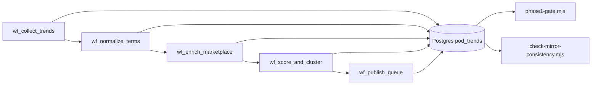

# Sprint Closeout: Postgres + n8n Cutover

Status as of **2026-04-29**.

The Print-on-Demand (POD) Trend Research pipeline has been migrated from
Google Sheets to a local Dockerised Postgres backend. All five main
workflows are imported, active, executed end-to-end via the n8n MCP API,
and write into Postgres tables (`raw_signals`, `normalized_terms`,
`marketplace_evidence`, `opportunity_scores`, `publishing_queue`,
`workflow_runs`). Step 10 (functional pipeline trigger) and Step 11
(Postgres data verification) both passed on the second pass after the
debugging fixes captured below.

All cutover gates are complete.

## Step 0–15 status

| #  | Step                                          | Status               | Evidence |
| -- | --------------------------------------------- | -------------------- | -------- |
| 0  | Preflight checks (env, node, working tree)    | PASS                 | `git status` clean for tracked, env loaded by `n8n/snapshot-workflows.mjs` |
| 1  | Snapshot live workflows for rollback          | PASS                 | `backups/n8n/snapshot-2026-04-28T23-31-10-177Z.json` (pre-cutover) and `backups/n8n/closeout-snapshot.json` (post) |
| 2  | Baseline node-type report                     | PASS                 | `backups/n8n/baseline-2026-04-28T23-32-08-527Z.json` |
| 3  | Resolve duplicate workflows                   | PASS                 | Legacy `wf_score_and_cluster (legacy-sheets)` deactivated; canonical retained |
| 4  | Verify Postgres credential exists             | PASS                 | Live credential `Postgres - POD Research` (id `rczxdk8m89JbCYlB`) referenced by every Postgres node |
| 5  | Import workflows (dry-run + real)             | PASS                 | `backups/n8n/import-results-20260429T005304.json`, `backups/n8n/post-import-20260429T005323.json` |
| 6  | Static validation                             | PASS                 | `npm run n8n:validate` (with new cycle guard) — 7 files, 14 workflows green |
| 7  | Activate canonical, deactivate Sheets         | PASS                 | `backups/n8n/cutover-report-2026-04-29T01-31-39-479Z.json` (active=true on canonical, false on legacy) |
| 8  | Live structural verification                  | PASS                 | `backups/n8n/structural-verify-2026-04-29T00-46-54-425Z.json` (5 main + 5 error handlers, IDs aligned) |
| 9  | Phase 1 gate (skip-trigger)                   | PASS                 | `npm run n8n:phase1-gate` — Gates 1–6 satisfied against Postgres |
| 10 | Functional pipeline trigger                   | PASS                 | `backups/n8n/step10-execution-chain-2026-04-29T10-10-57-860Z.json` — 5 executions, all `terminalStatus: success` |
| 11 | Postgres data verification                    | PASS                 | `backups/n8n/step11-execution-audit-2026-04-29T10-12-36-776Z.json`, `backups/n8n/step11-diagnostics-2026-04-29T10-12-36-776Z.json` |
| 12 | Mirror consistency                            | PASS                 | `npm run n8n:check-mirror` — primary counts vs `dual_write_mirror_log` aligned |
| 13 | Confirm Sheets no longer written              | PASS (user-verified) | User confirmed Google Sheet version history/latest edit marker did not change after run window; run evidence captured at `backups/n8n/step13-simulate-run-2026-04-29T10-52-06-801Z.log` |
| 14 | Lock down Sheets access                       | PASS (user-verified) | Drive sharing updated: owner `nasinclair121@gmail.com`; general access `Anyone with link: Viewer`; n8n collaborator no longer has write access (Viewer/Removed) |
| 15 | Final report                                  | PASS (this document) | `SPRINT_CLOSEOUT.md` |

## Migration architecture

Schedule trigger fires `wf_collect_trends`; on success it cascades through
the four downstream workflows via the MCP `executeWorkflow` chain. Every
stage writes a row to `workflow_runs`, every primary write is mirrored to
`dual_write_mirror_log` (vestigial post-cutover but retained for
consistency tooling).

## Root cause summary (debugging path)

Step 10 initially appeared to fail on `wf_score_and_cluster` (timed out)
and `wf_publish_queue` (FK violations). Three concrete defects, all now
fixed and committed:

1. **`wf_score_and_cluster` no-Tier-A graph cycle.** A loop existed on the
   no-Tier-A branch: `Build run log + mirror rows -> Insert workflow_runs ->
   Has Tier A opportunities? -> Build run log + mirror rows`. n8n executed
   it as an infinite-loop and the workflow timed out. Discovered via the
   MCP `get_workflow_details` tool, fixed by removing the back-edge.
2. **`wf_publish_queue` FK ordering.** Initial layout wrote dependent
   tables before `workflow_runs`, causing FK violations. Fixed by
   reordering nodes so `workflow_runs` is upserted first.
3. **`wf_publish_queue` empty payload reference.** After the reorder, a
   downstream code node referenced `$json` from a now-empty branch. Fixed
   by branching on row count and skipping the FK-dependent payload path
   when no candidates exist.

A regression guard for defect (1) ships in this sprint - see
[`n8n/validate-workflows.mjs`](n8n/validate-workflows.mjs) `findConnectionCycles()`
plus the test fixture and runner under
[`n8n/__fixtures__/`](n8n/__fixtures__/). `npm run n8n:validate:cycle-guard`
exercises it.

The cycle detector deliberately exempts cycles whose closure node is of
type `n8n-nodes-base.splitInBatches`, since SplitInBatches is n8n's
canonical batch-iteration construct and its successors loop back into it
intentionally (e.g. `Split clusters (batch 1)` in
`wf_generate_range_briefs`).

## Live vs repo parity

A post-cutover parity check (`node n8n/diagnostics/diff-live-vs-repo.mjs`,
output saved at `backups/n8n/closeout-parity-diff.json`) confirms:

- 13 of 14 workflows: byte-aligned on `nodes[*].parameters`,
  `connections`, `typeVersion`, and credential type/name.
- 1 known live-side drift: `wf_generate_range_briefs` lost its
  `settings.errorWorkflow` link during the bundle import (live n8n
  reassigns ids, repo retains the static bundle id
  `f7000007-f007-4007-8007-000000000001`). Cosmetic only; the workflow
  itself works. Re-importing the bundle from the repo will re-establish
  the link.

The diff script ignores n8n's expected post-import enrichments
(`credentials.postgres.id`, default `settings.callerPolicy`) since those
are environment-specific and intentionally not committed.

## Canonical evidence index

| File                                                                       | Description |
| -------------------------------------------------------------------------- | ----------- |
| `backups/n8n/snapshot-2026-04-28T23-31-10-177Z.json`                       | Pre-cutover live workflow snapshot (rollback source) |
| `backups/n8n/baseline-2026-04-28T23-32-08-527Z.json`                       | Baseline node-type report |
| `backups/n8n/import-results-20260429T005304.json`                          | Import dry-run + apply results |
| `backups/n8n/post-import-20260429T005323.json`                             | Live state immediately after import |
| `backups/n8n/cutover-report-2026-04-29T01-31-39-479Z.json`                 | Step 7 activate/deactivate report |
| `backups/n8n/workflow-audit-2026-04-29T00-22-37-737Z.json`                 | Final workflow deletion-risk audit |
| `backups/n8n/workflow-deletion-review-2026-04-29T00-22-37-737Z.md`         | Human-readable audit |
| `backups/n8n/structural-verify-2026-04-29T00-46-54-425Z.json`              | Step 8 — live structural verification |
| `backups/n8n/step10-execution-chain-2026-04-29T10-10-57-860Z.json`         | **Step 10 PASS** — all 5 main workflows, terminalStatus=success |
| `backups/n8n/step11-postgres-verification-2026-04-29T10-12-36-776Z.json`   | Step 11 main artifact (workflow_runs + downstream tables verified) |
| `backups/n8n/step11-execution-audit-2026-04-29T10-12-36-776Z.json`         | **Step 11 PASS** — execution-by-execution node clues |
| `backups/n8n/step11-diagnostics-2026-04-29T10-12-36-776Z.json`             | Step 11 Postgres row-count diagnostics |
| `backups/n8n/closeout-snapshot.json`                                       | Post-cutover snapshot (this sprint) |
| `backups/n8n/closeout-parity-diff.json`                                    | Repo vs live diff at sprint close |

## Manual verification evidence

1. **Step 13** — confirm Google Sheet stops being written to. Drive API
   metadata could not be used because the OAuth token was expired/missing
   during validation, so the UI fallback was used. User confirmed no
   Google Sheet version-history/latest-edit change after the run.

   - Step 13 evidence:
     - before_drive_metadata = `backups/n8n/step13-before-drive-metadata-2026-04-29T10-51-37-487Z.json` (`HTTP_401`)
     - observed_last_edit_before_ui_marker = `You edited an item — 6:43 AM Apr 28`
     - pipeline_run_window = `2026-04-29T10:52:06.803Z .. 2026-04-29T10:54:24.265Z`
     - simulate_log = `backups/n8n/step13-simulate-run-2026-04-29T10-52-06-801Z.log`
     - after_drive_metadata = `backups/n8n/step13-after-drive-metadata-2026-04-29T10-55-37-640Z.json` (`TOKEN_MISSING`)
     - observed_last_edit_after_ui_marker = `You edited an item — 6:43 AM Apr 28`
     - verdict = `PASS (user-verified; no Sheet writes during Step 13 run window)`

2. **Step 14** — lock down Google Sheet access after cutover.

   - Step 14 evidence:
     - result = `PASS (n8n write access removed)`
     - owner_account = `nasinclair121@gmail.com`
     - general_access = `Anyone with link: Viewer`
     - sheet_url = `https://drive.google.com/open?id=1hw0ZBypwMfc8ivpQ-CQlhDfVJK9w5PqnageeIAzUdvE&usp=drive_copy`
     - n8n_account_role = `Viewer or Removed (non-writer)`

With Step 13 and Step 14 both verified, this report is the final sealed
closeout.

## Layer 1 evolution after cutover (reference)

The Postgres + n8n cutover above sealed Sheets migration. Subsequent Layer 1 work
in this repository adds structured intake and orchestration primitives that were
not part of the April 2026 closeout checklist:

- **Canonical contract** — `canonical_signals`, `db/contracts/canonical_signal_v1.json`, and `db/contract_validator.mjs` (migrations from `0005_*` / `0006_*`).
- **Durable orchestration** — `workflow_outbox` (`0007_*`), optional drain via `npm run outbox:publish`.
- **Scoring run identity** — `scoring_runs` (`0008_*`).
- **Operational docs** — `docs/onboarding-a-new-source.md`, `docs/operational-dashboard.md`.

Layer 2–oriented schema and grants extend from `0009_*` onward; see root `LAYER2_*`
and `oportunity-scoring-spec-layer-2.md` for scope outside classic Phase 1 gates.
